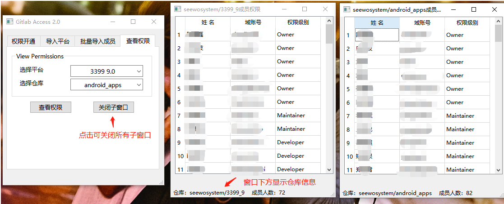

# GitlabAccess v2.2
GitlabAccessV2.3.zip

## 写在前面
使用python、以及gitlab rest api v4实现，仅支持gitlab仓库的权限管理。

## 0 主要功能说明
* 身份认证 - 支持Token导入
* 支持单个仓库成员权限管理
* 支持repo项目仓库成员权限管理和查看
* 支持批量开通成员的仓库权限
* 支持查看单个仓库的成员权限情况

## 1 v2.2 版本说明
#### 1.1功能说明
* 添加指定平台用户权限
* 通过repo xml导入平台仓库
* 通过仓库ID导入仓库
* 批量导入成员
* 查看仓库成员权限

#### 1.2 Bug修复
* Token检测错误问题
* 批量导入成员按钮禁用问题
* 开通权限时请求Gitlab API解析仓库ID失败问题

## 2 使用说明
点击下载链接，解压工具，进入GitlabAccessV2.2文件夹，**运行mainWindow.exe**。
（可自行创建应用程序的快捷方式，将快捷方式移动到桌面。）

#### 2.1 Gitlab Token导入
双击启动Gitlab Access应用程序，应用程序检测不到token会提示导入gitlab token。

点击确定，进入应用程序。

**获取token**

在Giltab 个人settings -> access token中，勾选所有read权限，生成一个token。保管好token，并复制token。

点击**导入Token**按钮，将复制的token粘贴到对话框中，并点击**OK**导入。

导入Token后，便可使用代码权限开通等功能。

#### 2.2 通过xml导入平台仓库
应用程序中点击上面第二个按钮，切换到导入平台页面。

点击选择xml文件，选择系统manifests仓库中任意一个平台代码的xml，填写平台名称，点击下面按钮**导入平台**

导入成功后，切换到**权限开通**页面，可以看到平台列表中新增了导入的平台

#### 2.2 通过仓库ID导入仓库
此功能可导入单个仓库。
首先需要在gitlab上搜索目标仓库，并复制仓库ID到Gitlab Access应用程序中，填写仓库名称后，即可导入成功。
导入成功后，**权限开通**页面的平台列表也会随之更新

#### 2.3 使用权限开通功能

在导入平台仓库、单个仓库之后，切换到**权限开通页面**，此时的**平台列表**不再是空白，输入域账号，点击**确认开通**，即可开通权限。

#### 2.4 使用批量开通权限功能
将页面切换到**批量导入成员**，在使用此功能之前，你需要先准备一个txt文本文件，将需要开通权限的成员域账号按照以下格式填写：

填写完毕保存文件后，点击**选择成员名单**，将该文件导入。
然后选择需要开通权限的**平台仓库**以及**权限等级**。

#### 2.5 查看仓库成员权限
在导入了平台仓库之后，此功能可使用。
将页面切换到**查看权限**，选择平台后，选择仓库，即可查看一个仓库的成员名单以及权限等级。
**关闭子窗口**可关闭同时查看的所有仓库的信息。

 
